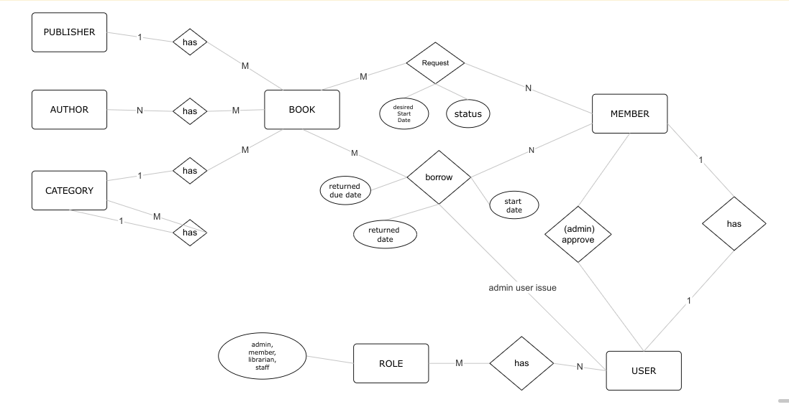

# 📚 Library Management System

This project is a **Spring Boot-based Library Management System** that allows administrators, librarians, staff, and members to manage books, users, and borrowing workflows in a secure and structured way.

## 🔧 Features

- 🔐 **JWT Authentication & Role-based Access Control**
- 📘 Book management with full metadata (authors, publishers, categories, edition, etc.)
- 👥 User and member management with role approval flow
- 🔄 Book borrowing and return workflow with request/approval by Admin
- 🧠 Recursive-safe hierarchical category structure
- 📦 RESTful API for all operations

---

## 🧪 Roles & Permissions

| Role      | Capabilities |
|-----------|--------------|
| **Admin** | ✅ Full control over the system, including approving borrow/return requests |
| **Staff** | 👥 Manage users and promote users to "Member" |
| **Librarian** | 📚 Manage books, authors, publishers, and categories |
| **Member** | 📩 Request to borrow books, view own borrow history |

---

## 🛠️ Tech Stack

- **Java 17**
- **Spring Boot**
  - Spring Data JPA
  - Spring Security (JWT Authentication)
- **PostgreSQL** (or any relational DB)
- **Lombok** (for clean code)
- **ModelMapper** (optional for DTO mapping)
- **Maven**

---

## 📦 Entities Overview

- **User**: Application users with one or more roles (Admin, Librarian, Staff, Member)
- **Member**: Special users approved by Staff to borrow books
- **Book**: Core entity containing metadata, availability(Number of copies), and borrower relationships
- **Author / Publisher / Category**: Book metadata entities
- **BorrowTransaction**: Tracks book requests, issue date, due date, return date
- **Category**: Supports hierarchical structure with parent-child relationships

---

## 📸 ERD (Entity Relationship Diagram)



---

## 🔐 Authentication

This project uses **JWT (JSON Web Token)** for secure authentication and role-based authorization.

- Login endpoint issues a JWT token
- Roles are embedded in the token and used for access control
- Protected endpoints require a valid token in the `Authorization` header:


---

## 🚀 API Endpoints (Overview)

### 🔑 Authentication
- `POST /auth/register`
- `POST /auth/login`

### 👤 User Management
- `GET POST /users`
- `POST /members/add/{userId}` – _(Staff only)_

### 📚 Book Management
- `POST /books` – _(Librarian only)_
- `GET /books`
- `DELEtE /books/{id}`

### 🔄 Borrowing Flow
- `POST /borrow-requests` – _(Member)_
- `POST /borrow-requests/{borrowingId}/approve` – _(Admin)_
- `POST /borrows/{borrowingId}/return` – _(Admin)_

### 📁 Metadata Management
- `POST GET /authors`
- `POST GET /publishers`
- `POST GET /categories`

---

## 📥 Sample Data

 `/resources/data.sql` 

---

## 📌 How to Run

```bash
# Clone the repository
git clone <your-repo-url>
cd library-management-system

#create database user and password and dbname 
all => "library"

# Run the application
./mvnw spring-boot:run
